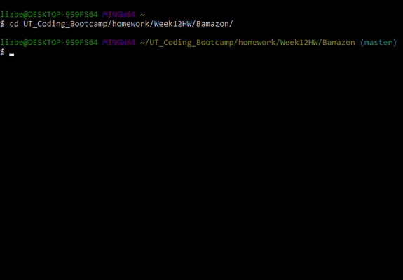
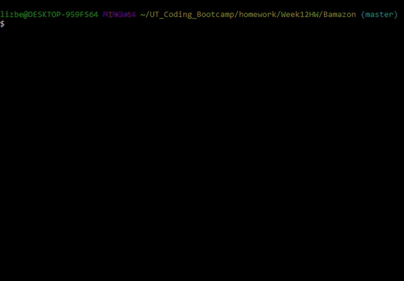

Bamazon
#######

Overview
********
Bamazon is an Amazon-like storefront that uses MySQL to store the product inventory. The bamazonCustomer app takes in orders from customers and depletes stock from the store's inventory. The bamazonManager app allows the manager to check the store's inventory, add additional inventory to existing products, and to add new products.

Usage
*****
Before using the apps, you must run npm install to install dependencies

.. code:: bash

  $ npm install

bamazonCustomer
===============

* To start the program, type the following on the command line while in the directory where the program is saved:

.. code:: bash

  	$ node bamazonCustomer.js

* Select the item from the list that you would like to purchase and press enter. You will be asked for the quantity that you would like to purchase and then to confirm your purchase. If there is sufficient inventory in stock of the item selected, then you will be given the total for your order, and the database will be updated with the new quantity in stock.

* After each purchase, you will be asked whether you would like to Keep Shopping or to exit. Highlight your choice using the arrow keys and press enter.

bamazonManager
==============

* To start the program, type the following on the command line while in the directory where the program is saved:

.. code:: bash

  	$ node bamazonManager.js

* Select what you would like to do from the list using the arrow keys and press enter

	+ View Products for Sale
		Displays all items in inventory
	+ View Low Inventory
		Displays all items in inventory with a stock_quantity below 5
	+ Add to Inventory
		- Allows the user to increase the stock_quantity for an item in inventory
		- You will be prompted to enter the quantity to add and then to confirm
	+ Add New Product
		- Allows the user to add a new product to the inventory
		- You will be prompted to enter the product name, department, price, and quantity, and then to confirm
	+ Exit
		Exits the program